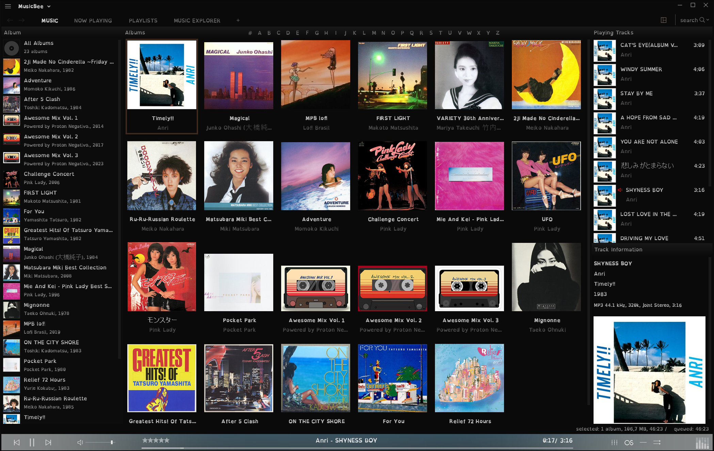

# YODA, Youtube Online Download Assistant
### YouTube Playlist Downloader

Este é um script em Python que baixa playlists do YouTube em formato MP4 e MP3 enquanto adiciona metadados nos arquivos MP3 para facilitar a organização e categorização da sua biblioteca de músicas.

## Requisitos

- Python 3.x
- Bibliotecas Python: pytube, tqdm, moviepy, mutagen

Você pode instalar as dependências com o seguinte comando:

```
pip install -r requirements.txt
```

## Como Usar

1. Clone este repositório para o seu ambiente local:

```
git clone https://github.com/protonnegativo/YODA.git
```

2. Navegue até o diretório do projeto:

```
cd YODA
```

3. Execute o script:

```
python run.py
```

4. Quando solicitado, insira a URL da playlist do YouTube que você deseja baixar e pressione Enter.

5. Os vídeos serão baixados e convertidos para MP3. Os arquivos serão salvos na pasta "downloads/{nome-da-playlist}", com subpastas "mp3" e "mp4" para os arquivos convertidos e originais, respectivamente.

## Funcionalidades

O script oferece as seguintes funcionalidades:

1. **Download da Playlist do YouTube:** Baixa uma playlist do YouTube para a sua máquina.

2. **Conversão para MP3:** Converte os vídeos da playlist para o formato MP3, permitindo que você os ouça offline.

3. **Adição de Metadados nos Arquivos MP3:**
   - **Número Sequencial:** Cada faixa MP3 recebe um número sequencial como metadado, indicando sua posição na playlist.
   - **Título do Vídeo:** O título do vídeo do YouTube é adicionado como título da faixa MP3.
   - **Artista Participante:** O nome do canal do YouTube que postou o vídeo é adicionado como artista participante.
   - **Artista no Álbum:** É adicionado "Powered by Proton Negativo." como uma forma de facilitar a categorização no MusicBee. (pode ser alterado manualmente conforme necessário)
   - **URL do Autor:** O link do vídeo do YouTube é adicionado como a URL do autor, incluindo o ano de publicação.
   - **Nome da Playlist:** O nome da playlist é adicionado como metadado de álbum.
   - **Ano de Publicação:** O ano de publicação do vídeo é adicionado como metadado.


## Uso com o MusicBee

Este script é útil para baixar playlists do YouTube e importá-las para o MusicBee, um player de música popular. Ao converter os vídeos para MP3 e adicionar metadados, os arquivos resultantes podem ser facilmente importados para a biblioteca do MusicBee.

## My MusicBee



# Roadmap

- [x] Implementar funcionalidade para baixar playlists do YouTube.
- [x] Converter vídeos baixados para MP3.
- [x] Adicionar metadados do YouTube aos arquivos MP3 (título, artista, álbum, etc.).
- [x] Suporte para salvar arquivos MP3 em pasta específica.
- [x] Suporte para salvar arquivos MP4 em pasta específica.
- [x] Coletar metadados do Spotify.
- [x] Utilizar metadados do YouTube para auxiliar no filtro de busca de metadados no Spotify.
- [x] Salvar Cover.jpg na pasta mp3.
- [x] Adicional opção de limpar nomes antes de buscar metadados no Spotify.
- [x] Adicionar suporte para baixar vídeos individuais do YouTube.
- [x] Permitir ao usuário escolher entre baixar apenas MP3, apenas MP4 ou ambos.
- [x] Alerta quando a chave da API do Spotify não for fornecida.
- [x] Inserir pasta manual para apenas buscar metadados.
- [ ] Opção de salvar configurações.
- [ ] Adicionar opção para utilizar ou não o Spotify para adicionar metadados.
- [ ] Documentação sobre como criar e adicionar a chave da API do Spotify.
- [ ] Melhorar o tratamento de erros e mensagens de erro mais descritivas.
- [ ] Implementar logging para registrar as ações do programa.
- [ ] Implementar uma interface gráfica de usuário (GUI) para facilitar a interação com o programa.
- [ ] Implementar testes automatizados para garantir a estabilidade do código.
- [ ] Melhorar a eficiência do programa para downloads de grandes playlists.
- [ ] Refatorar código para melhorar a legibilidade e manutenibilidade.
- [ ] Mais fontes de metadados? Integração direta com MusicBee? ??

## Como Contribuir
Se você tiver ideias para novos recursos ou melhorias, sinta-se à vontade para abrir uma issue ou enviar um pull request! Estou aberto a contribuições e feedback da comunidade.

#        https://www.youtube.com/playlist?list=PL3bxxpCpkx3hlJ8H5Dv8mP8SI8Szlsv-H